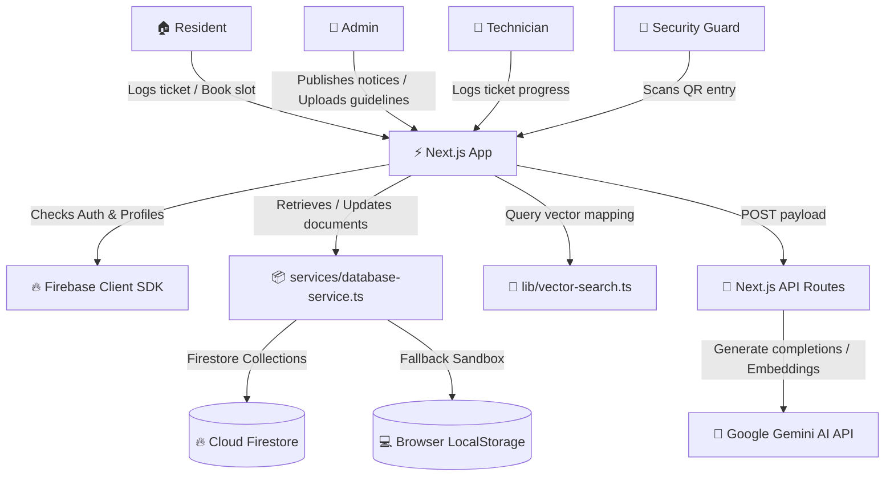

# 👑 CommuniSync AI
### The Smart Neighborhood Operating System

🚀 **Live Production App:** [https://communisync-ai.vercel.app](https://communisync-ai.vercel.app)

---


CommuniSync AI is a complete, production-ready community management SaaS platform digitizing residential society operations. Powered by **Gemini AI**, it implements automated complaint dispatchers, local RAG vector search, time-locked visitor passes, and facility booking schedules.

---

## ✨ Primary Features

### 🧠 1. AI Community Assistant (RAG)
- **Document Chunk Ingestion:** Admins paste or upload guidelines (timings, parking rules, circulars). Text is split into overlapping chunks.
- **Vector Indexing:** Generates numerical vectors using Gemini's `text-embedding-004` model.
- **Proximity Search:** User queries are matched against chunks using client-side **Cosine Similarity** formulas in real-time.
- **Context-Bound Conversational Bot:** A `gemini-2.5-flash` model constructs answers strictly from retrieved contexts, listing cited source guidelines to prevent hallucinations.

### 🚨 2. Smart Complaint Management & AI Dispatch
- **Filing:** Residents log tickets attaching photos (leakage, infrastructure) and location notes.
- **Gemini Copilot Preview:** As the user types, a background API classifies category, priority (low to critical), department, severity, and resolution ETA.
- **Admin Dispatcher:** Admins view incoming tickets and assign specialized technicians based on specialty (e.g. plumbing, electrical).
- **Technician Logs:** Handymen log progress (assigned -> in progress -> resolved) and add completion notes.

### 📅 3. Conflict-Free Amenity Booking
- **Facility List:** Reservable slots for Gym, Pool, Clubhouse, Tennis Court, and Hall.
- **Conflict Prevention:** Choosing a date dynamically checks the database, disabling reserved blocks to prevent double-booking.
- **Audit Logs:** Residents track and cancel their bookings.

### 🎫 4. Visitor Gate Pass Control
- **Pre-Authorization:** Residents register guests, generating secure checkcodes and **QR Codes** (rendered via `qrcode` library).
- **Security Check-In/Out:** Guards inspect passes using a simulated scanner, approving entries and writing timestamps to gate logs.

### 📢 5. Announcement Board
- Admins post emergency notices, maintenance outages, or events.
- Notices dynamically update on resident dashboards with priority badges (Emergency, General, Maintenance).

---

## 🗝️ Developer Quick-Access Accounts
The application is pre-configured with a client-side database simulation (LocalStorage). If launched without Firebase keys, it falls back to sandbox mode. Use any password (e.g., `password`) to log in:

| Role Badge | Demo Email | Preset Name | Gate / Specialty |
| :--- | :--- | :--- | :--- |
| **👑 Admin** | `admin@communisync.com` | Aravind Swamy | Board Executive |
| **🏠 Resident** | `resident@communisync.com` | Vikram Seth | Tower A - 501 |
| **🔧 Technician** | `plumber@communisync.com` | Ramesh Kumar | Plumbing specialty |
| **👮 Guard** | `guard@communisync.com` | Bahadur Singh | Gate 1, day shift |

---

## 🏗️ Architecture Design



---

## 🚀 Installation & Local Launch

### 1. Pre-requisites
Ensure Node.js v20+ and npm are installed on your system.

### 2. Standalone Node.js Dev Run
```bash
# Clone the repository
git clone https://github.com/HarshitMendiratta-18/Smart-ai-assistant.git
cd Smart-ai-assistant

# Install dependency tree
npm install

# Start Next.js development server
npm run dev
```
Open **[http://localhost:3000](http://localhost:3000)** in your browser.

### 3. Production Compilation Build
```bash
# Compile and build pages
npm run build

# Start local server
npm run start
```

### 4. Docker Launch
Or orchestrate the container locally:
```bash
docker-compose up --build
```
This maps port 3000 to the container and launches the Next.js production build standalone.

---

## 📁 Scalable Directory Map

```
Smart-ai/
├── app/                        # Next.js App Router routes & layouts
│   ├── (auth)/                 # SignIn & SignUp page layouts
│   ├── (dashboard)/            # RBAC Protected dashboards (Resident, Tech, Guard, Admin)
│   └── api/                    # Serverless API endpoints (AI, Reports, Ingestion)
├── components/                 # Reusable buttons, inputs, modals, sidebars, alerts
├── features/                   # Core modules (Complaints, Bookings, Visitors, Notices)
├── hooks/                      # Global context states (useAuth, useToast)
├── services/                   # Business adapters (Firestore Adapters, Gemini API interfaces)
├── firebase/                   # client & admin SDK configurations
├── lib/                        # Mathematics functions (Cosine Similarity vector mapping)
├── docker/                     # Docker standalone config
└── tests/                      # Unit test suites (Vitest math vector verifications)
```

---

## 📜 License
This project is open-source and available under the [MIT License](LICENSE).
